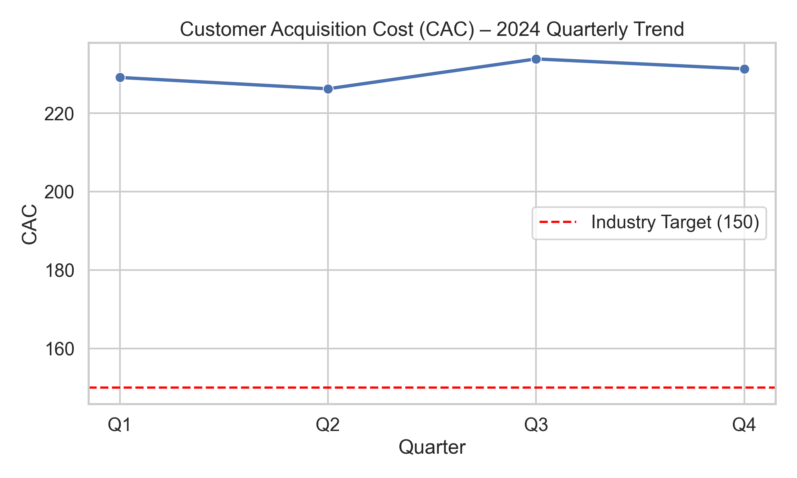
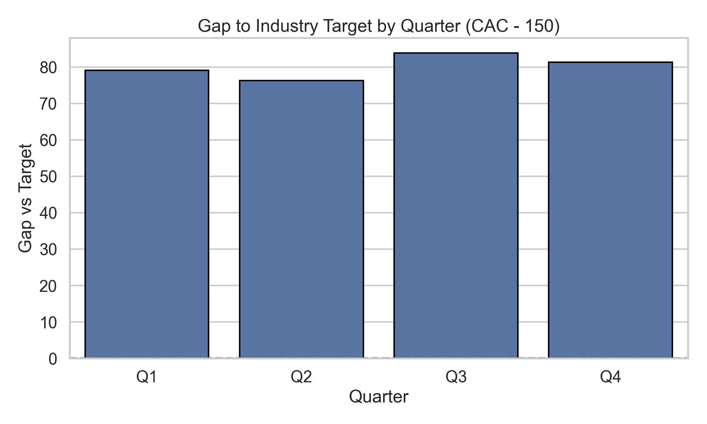

# Financial Services Performance Analysis – CAC 2024

**Verification Email:** 23f2004818@ds.study.iitm.ac.in

This pull request analyzes quarterly **Customer Acquisition Cost (CAC)** performance for 2024 and compares it with the **industry benchmark target of 150**. Insights will guide strategic decisions to **optimize digital marketing channels**.

## Dataset
- Q1: 229.12  
- Q2: 226.23  
- Q3: 233.85  
- Q4: 231.32  
- **Average: 230.13**

**Industry Target:** 150

## Visualizations
- CAC Trend vs. Target  
  
- Gap to Target per Quarter  
  

## Key Findings
1. CAC is **consistently above target** across all quarters. The **annual average is 230.13**, which is **~53.4% higher** than the 150 benchmark.
2. **Q3 peaks at 233.85**, indicating elevated spend without proportional efficiency gains.
3. Average gap vs. target ≈ **80.13**, signaling substantial room for improvement.

## Business Implications
- **Unit economics pressure:** Lower LTV/CAC, longer payback periods.
- **Budget efficiency risk:** Underperforming channels or conversion friction.
- **Forecast sensitivity:** Scaling growth at current CAC requires disproportionately higher spend.

## Recommendations – Optimize Digital Marketing Channels
1. **Channel mix & bidding:** Shift budget to high-ROAS search/performance; trim low-ROAS display/social; use value-based bidding (tROAS/tCPA), negatives, placement exclusions.
2. **Targeting & segmentation:** Build high-intent audiences; suppress low-LTV cohorts; frequency-cap; run incrementality tests.
3. **Creative & CRO:** Refresh creatives regularly; improve page speed & clarity; reduce form friction.
4. **Measurement & attribution:** Server-side tagging; clean events; MMM/MTA for marginal ROAS allocation.

> **Explicit solution:** _optimize digital marketing channels_

## Reproduce
```bash
pip install -r requirements.txt
python analysis.py
